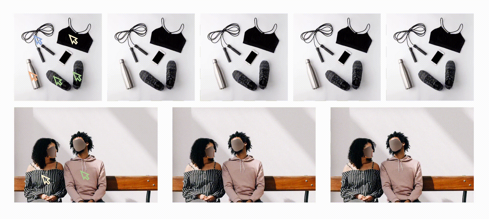

## ___***[CVPR2024] Unifying Automatic and Interactive Matting with Pretrained ViTs***___

<p align="center"></p>

## ⚙️ Setup

### Install Environment via Anaconda (Recommended)
```bash
conda create -n SMat python=3.8
conda activate SMat
python -m pip install 'git+https://github.com/facebookresearch/detectron2.git'
pip install -r requirements.txt
```


## 💫 Inference 
### Local Gradio demo

1. Download the pretrained models and put them in the './ckpt' dir.
Download it from [GoogleDrive](https://drive.google.com/file/d/1vI1ujNqQKaJ2KJ5d10mUcPftHckATpoQ/view?usp=drive_link) or [BaiduYunPan](https://pan.baidu.com/s/19KqvDztD5manMvk3j_q13A?pwd=0apd)
2. Input the following commands in terminal.
```bash
  sh app_inference.sh
```

**Example**
https://github.com/zixuan-ye/SmartMatting/assets/54745326/b9966a7b-00b1-45ed-90a7-f8a295ff4644


### Inference Matting Datasets

1. Modify L27-44 in inference_dataset.py with the correct path
2. Modify the benchmark you want to validate in inference_dataset.sh
3. Run the following command.
```bash
  sh inference_dataset.sh


```


---
## 😉 Citation
```
@inproceedings{ye2024unifying,
      title={Unifying Automatic and Interactive Matting with Pretrained ViTs}, 
      author={Ye, Zixuan and Liu, Wenze and Guo, He and Liang, Yujia and Hong, Chaoyi and Lu, Hao and Cao, Zhiguo},
      booktitle={Proc. IEEE/CVF Conference on Computer Vision and Pattern Recognition (CVPR)},
      year={2024}
}
```


## 🤗 Acknowledgements
Our codebase builds on [ViTMatte](https://github.com/hustvl/ViTMatte). 
Thanks the authors for sharing their awesome codebases! 


## 📢 Disclaimer
We develop this repository for RESEARCH purposes, so it can only be used for personal/research/non-commercial purposes.
****
